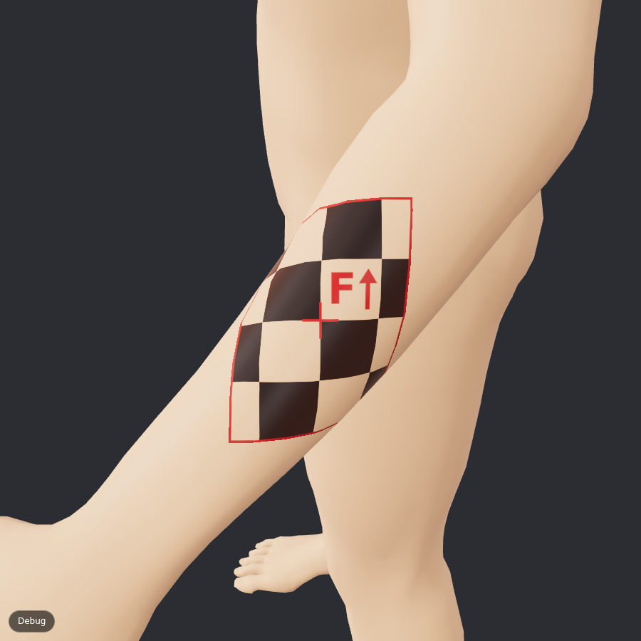
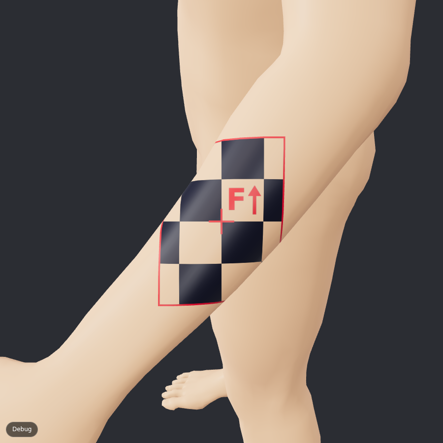
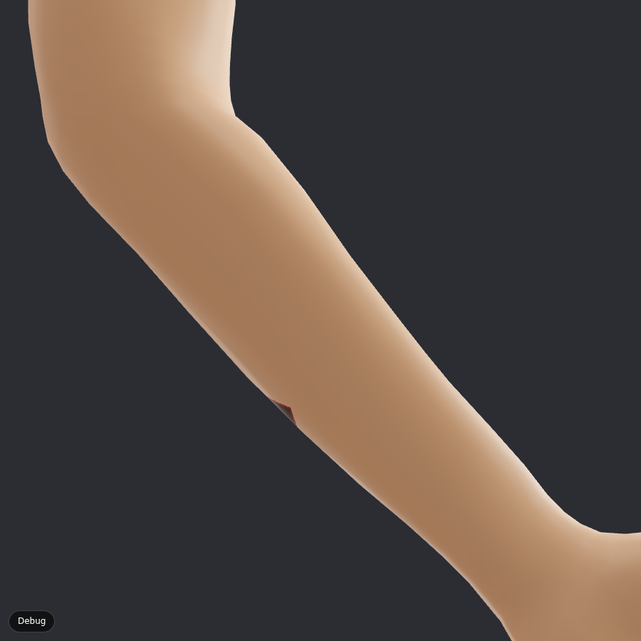
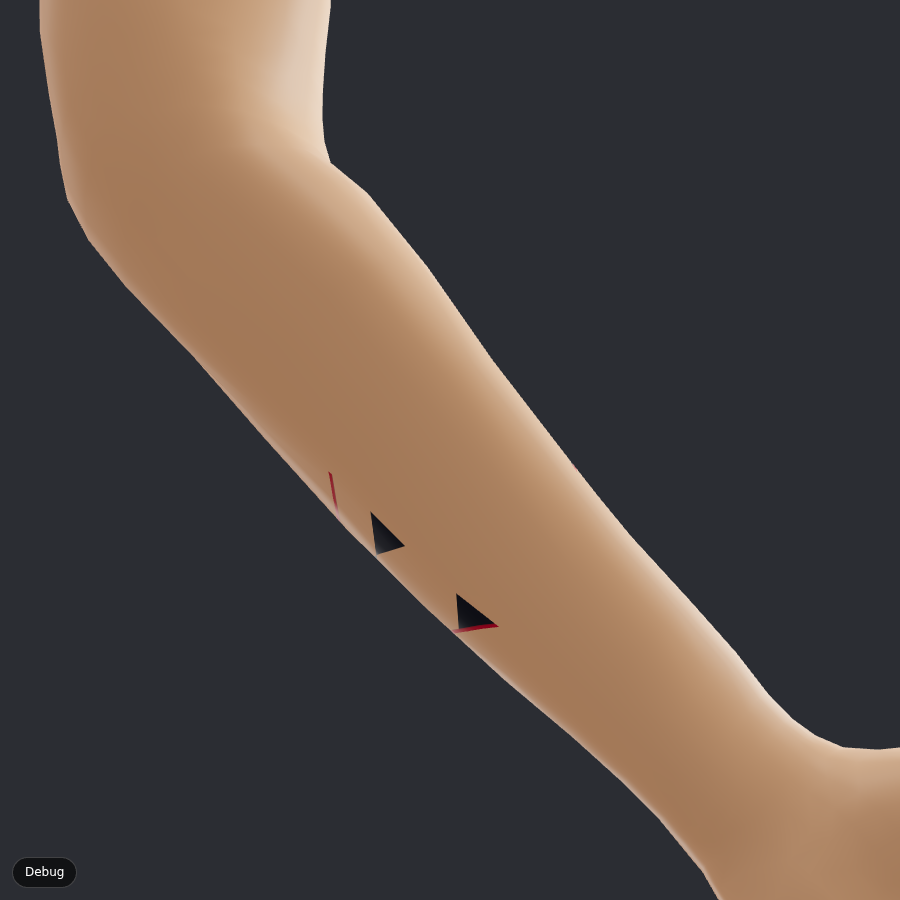
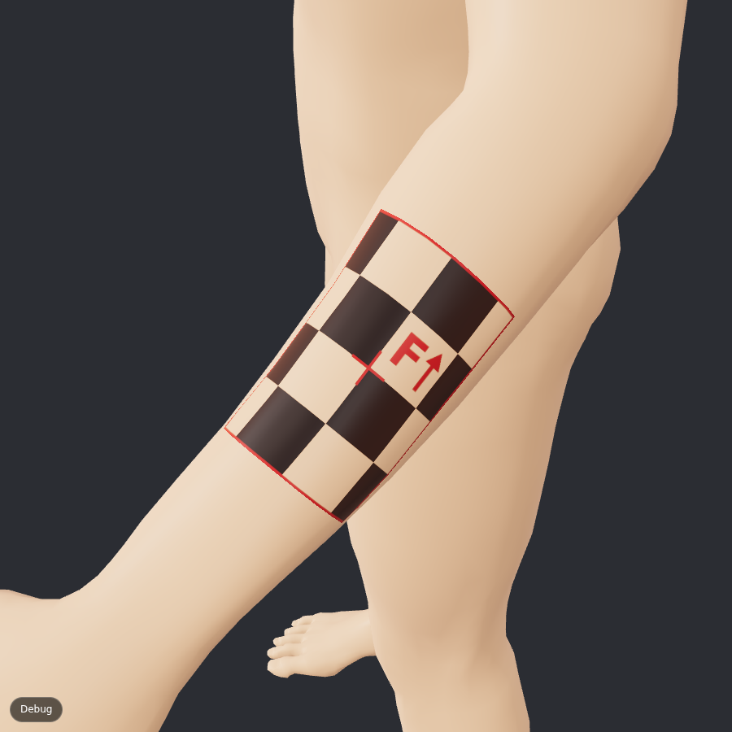
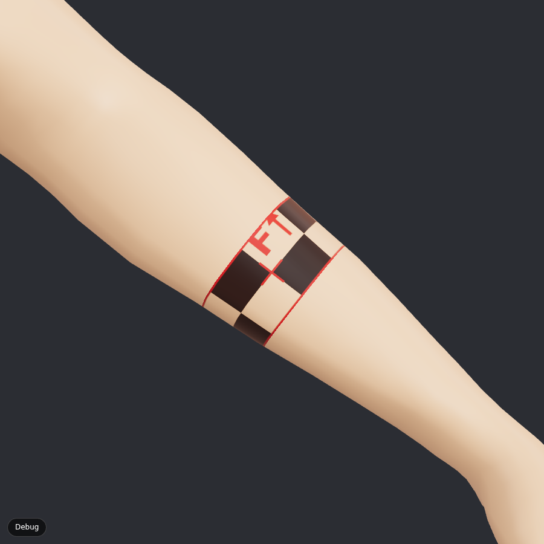
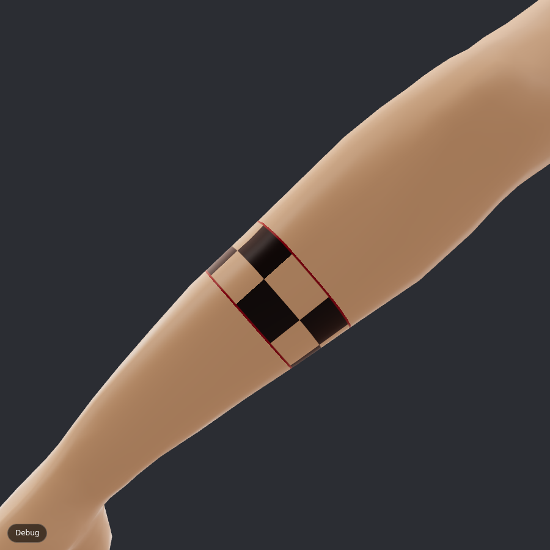
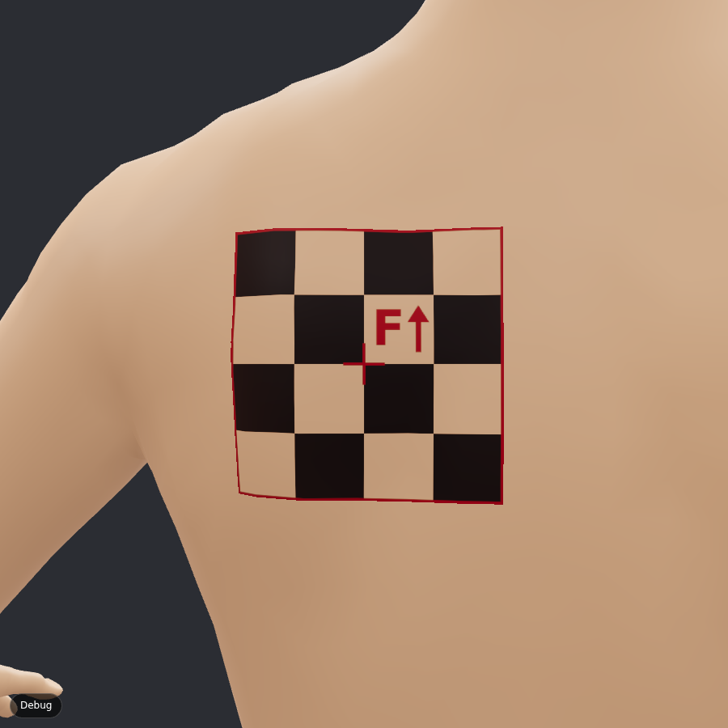
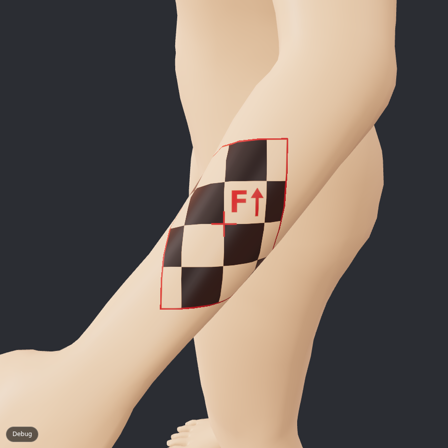
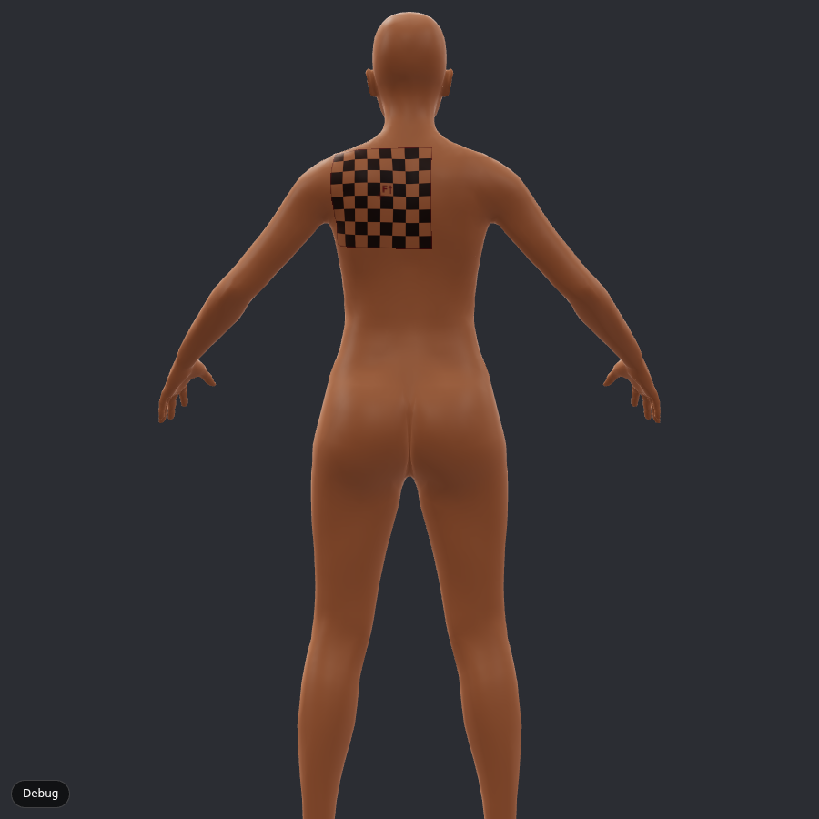

# Phase 0 report: does the wrap work?

**Short answer: yes.** On real, to-scale male and female bodies, the exponential map holds a 1-inch
grid to within 5% over 91–100% of a forearm design and 100% of a shoulder-blade design, and the
cylindrical wrap closes a full band around the forearm with a 0.00 mm seam. three.js
`DecalGeometry`, the method most web tattoo previews use, mirrors 16–34% of a forearm design onto
the far side of the arm.

## 1. Body models

| | Male | Female |
|---|---|---|
| Source | Anny v0.6 (Apache 2.0) + MakeHuman CC0 assets | same |
| Phenotype | gender 0, age 0.72 (young adult), others 0.5 | gender 1, same |
| Exported height | 1.904 m | 1.767 m |
| Vertices / triangles (skin only) | 13,503 / 24,864 | 13,503 / 24,864 |
| GLB size | 840 KB (uncompressed) | 840 KB |
| Pose | A-pose, relaxed elbows | same |

Licensing is confirmed in [../licenses.md](../licenses.md). The app scales the body uniformly to the
client's height (defaults 5'10" and 5'5").

## 2. How we measured

The test design is a checkerboard with exactly 1-inch cells (an "F↑" marks up and un-mirrored).
For every triangle of the body under the design, we compute the linear map from design to skin and
its two singular values: how long a 1-inch segment of the design becomes on the skin in the most
stretched and most squashed directions. From those:

- **Size error** = how far a 1-inch cell is from 1 inch, in its worst direction.
- **Not square** = how far a square cell is from square (ratio of the two directions − 1).
- **Mirrored** = the design is flipped on that triangle (seen from outside the skin), which is what
  "bleeding through" a limb looks like.
- **Within 5%** = share of the design's skin area where size and squareness are both within 5% and
  nothing is mirrored. This is the spec's acceptance check ("each cell within 5% of 1 inch and
  visually square").

All statistics are area-weighted. Code: `src/projection/distortion.ts`, study: `src/phase0/study.ts`,
full table: [metrics.md](metrics.md). Re-run with `npm run measure`.

## 3. Results

Placements: left forearm halfway between elbow and wrist, front and outer side; full band around
the same spot; left shoulder blade.

| Scenario | Method | Within 5% (male / female) | Size error p95 | Mirrored |
|---|---|---|---|---|
| Forearm outer, 3×4 in | **Exponential map** | **98% / 100%** | 3.5% / 3.0% | 0% |
| | Cylindrical, arc length, fitted axis | 45% / 47% | 6.8% / 6.5% | 0% |
| | Cylindrical, θ·r (spec formula), joint axis | 43% / 37% | 10.7% / 33.0% | 0% |
| | three.js DecalGeometry | 26% / 22% | 1175% / 2451% | **16% / 30%** |
| Forearm front, 3×4 in | **Exponential map** | **91% / 93%** | 5.9% / 5.3% | 0% |
| | Cylindrical, arc length, fitted axis | 69% / 61% | 5.5% / 5.3% | 0% |
| | Cylindrical, θ·r, joint axis | 20% / 20% | 21.3% / 13.7% | 0% |
| | three.js DecalGeometry | 36% / 28% | 773% / 788% | **22% / 34%** |
| Forearm full band, 1.5 in | **Cylindrical, arc length + close band** | 63% / 61% | 6.4% / 6.3% | 0%, **seam 0.00 mm** |
| | Cylindrical, θ·r + close band | 45% / 53% | 10.8% / 12.2% | 0%, seam 0.00 mm |
| | Fixed-width band (no closing), 3 in | 25% / 23% | 13.6% / 13.1% | seam **+17.7 / −18.1 mm** |
| | three.js DecalGeometry | impossible | | |
| Shoulder blade, 4×4 in | **Exponential map** | **100% / 100%** | 2.4% / 2.0% | 0% |
| | three.js DecalGeometry | 75% / 82% | 12.1% / 19.3% | 0% |

Exponential map speed (Node, one CPU core; the browser is similar):

| Design | 2×2 in | 4×4 in | 8×8 in | 12×12 in |
|---|---|---|---|---|
| Time | 0.4–1.5 ms | 0.6–0.8 ms | 1.6–1.9 ms | 18.8–19.4 ms |
| Vertices visited | 42–48 | 84–97 | 243–307 | ~6,200 |

That is fast enough to recompute live while dragging, on the main thread, up to about 8×8 in. A
12×12 in back piece takes ~19 ms (the front reaches the denser neck and arm mesh), so Phase 1 moves
it into a Web Worker as the spec asks.

## 4. Screenshots

Rendered by `npm run screenshots` (headless Chromium, software GPU). The skin material is the Phase 0
placeholder; realism comes in Phase 1–2.

| | |
|---|---|
|  Exponential map, outer forearm |  DecalGeometry, same spot: looks similar from the front… |
|  …exponential map, other side of the arm: clean |  …DecalGeometry, other side of the arm: shards bleed through |
|  Cylindrical wrap, 3×4 in patch |  Full band, 1.5 in, front |
|  Same band from behind: the seam closes, cells alternate across it |  Exponential map, shoulder blade, 4×4 in |
|  Female body, exponential map |  8×8 in on the back, darker skin tone |

## 5. What we learned

1. **DecalGeometry is not usable on limbs.** It projects through the arm: 16–34% of a forearm design
   lands mirrored on the far side, and the sides of the arm stretch by many times. On the flatter
   shoulder blade it is passable (75–82% within 5%) but still clearly worse than the exponential map.
2. **The textbook cylinder formula (u = θ·r) is not good enough.** Forearms are oval, not round, and
   the elbow and wrist joints sit off-centre. Three changes, all in `cylindrical.ts`, took the
   95th-percentile size error from 11–33% down to 5–7%:
   - fit the axis through the cross-section centres instead of the joints,
   - measure true arc length around each ring (from a lookup table) instead of θ·r,
   - measure along the skin, not along the bone.
3. **The remaining ~5% on cylinders is the forearm twisting.** Its oval cross-section rotates along
   its length (the two forearm bones cross). No cylindrical coordinate can remove that. Patches don't
   need a cylinder; bands do, and a band on a tapering limb can't be exactly 1 inch everywhere
   anyway (it must be smaller at the wrist to close).
4. **The exponential map is the best general method.** It is local, so it adapts to whatever the
   skin does under the design: 91–100% within 5% everywhere we tried, never mirrored, and fast.
   Its limit: it can't close a band, and it folds past about half way round a limb.

## 6. Recommendation for Phase 1

- **Exponential map is the default** for every placement: back, chest, ribs, shoulders, and patches
  on arms and legs. Run it in a Web Worker; recompute live while dragging.
- **Cylindrical wrap (arc length, fitted axis) for bands and sleeves**: switch automatically when
  the artist picks "full band" or when a design on a limb is wider than ~45% of the limb's
  circumference.
- **Drop DecalGeometry** except as a debug comparison.
- **Elbow and knee**: blend the two limb frames across the joint (spec item), then measure a design
  crossing the elbow the same way.
- **Body shape**: replace uniform height scaling with Anny's height/weight/muscle blend shapes, so a
  tall client doesn't get proportionally thicker arms.

## 7. Acceptance checks

| Check (spec) | Result |
|---|---|
| A 1-inch grid wrapped on a forearm measures within 5% of 1 inch per cell, cells square | **Met by the exponential map**: outer forearm 98–100% of the area within 5% (mean error 1.0%, p95 3.0–3.5%); front 91–93% (p95 5.3–5.9%). The cylinder gets 45–69% (p95 5.3–6.8%). |
| A full 360° band on the forearm closes with no visible gap or overlap | **Met**: 0.00 mm seam mismatch on every ring (measured); seam not visible in the screenshot from behind. |
| A back piece crossing a UV seam shows no seam line | Not measured in Phase 0 (needs the Phase 2 ink-map bake). Live rendering computes placement in 3D, so UV seams cannot cut the design. |
| Line art imports cleanly; .ai import | Phase 1. |
| Touch on iPad Safari | Not tested on a real iPad yet. The page uses WebGL 2, `texelFetch` (no float-texture filtering needed), and touch orbit controls. Please try it on the studio iPad. |

## 8. Known limitations of the test page

- One design layer at a time, no drag-to-move (tap to place), no elbow blending.
- Uploaded images are rasterised as-is (no background removal yet). Because ink is multiplied into
  skin, white backgrounds already vanish.
- Skin is a simple physically based material with sheen. Pores, subsurface scattering and the
  healed/fresh/aged looks are Phase 1–2.
