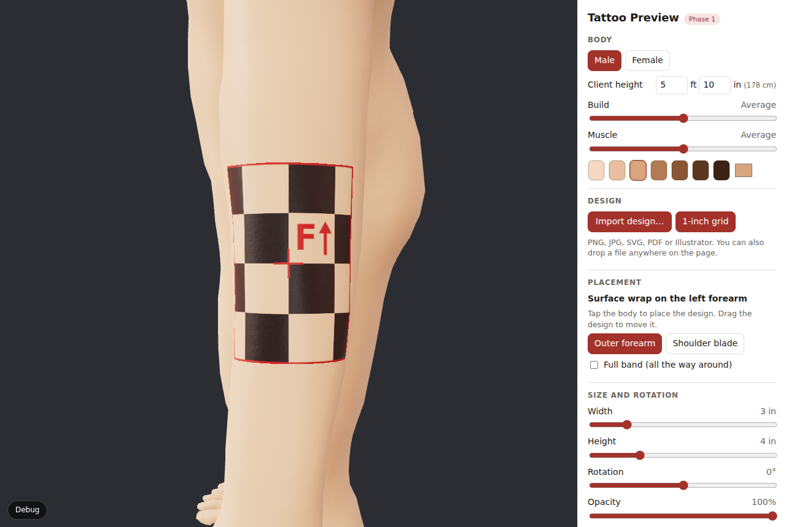
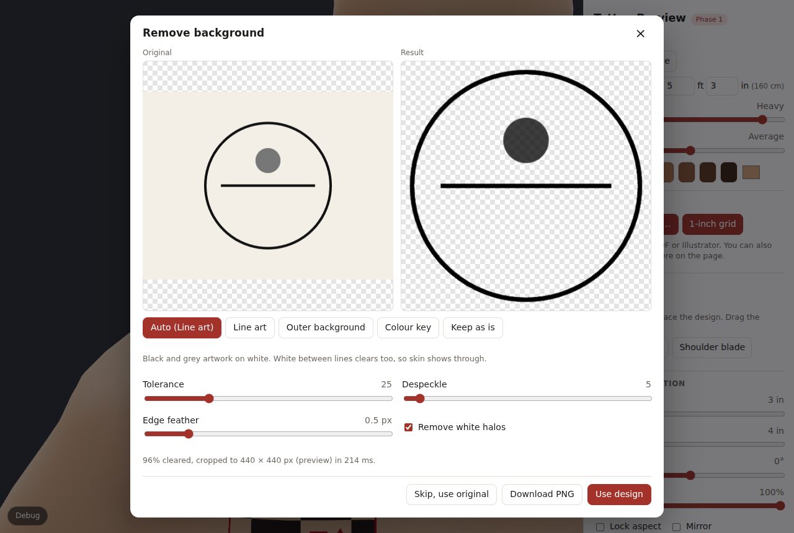
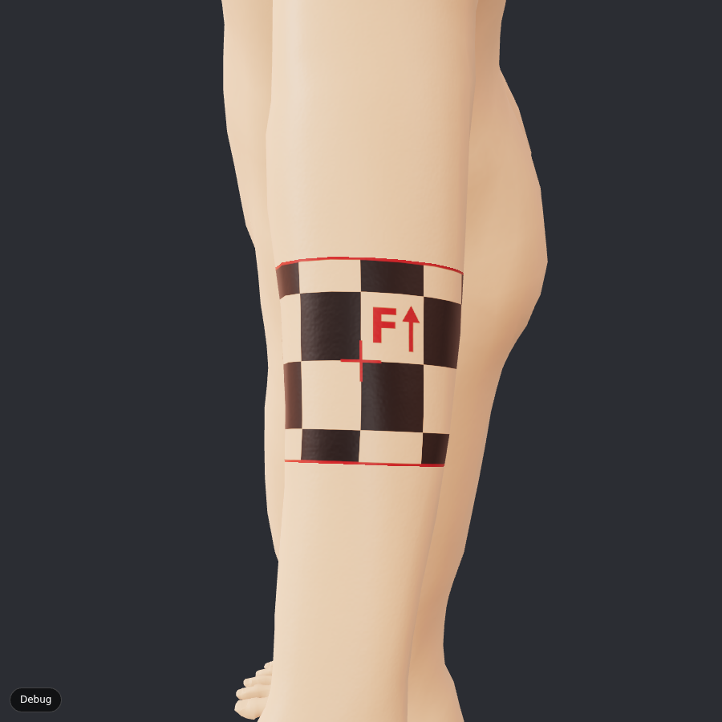
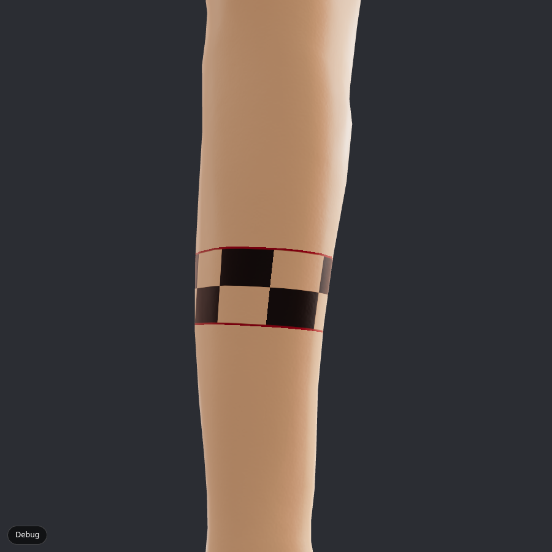
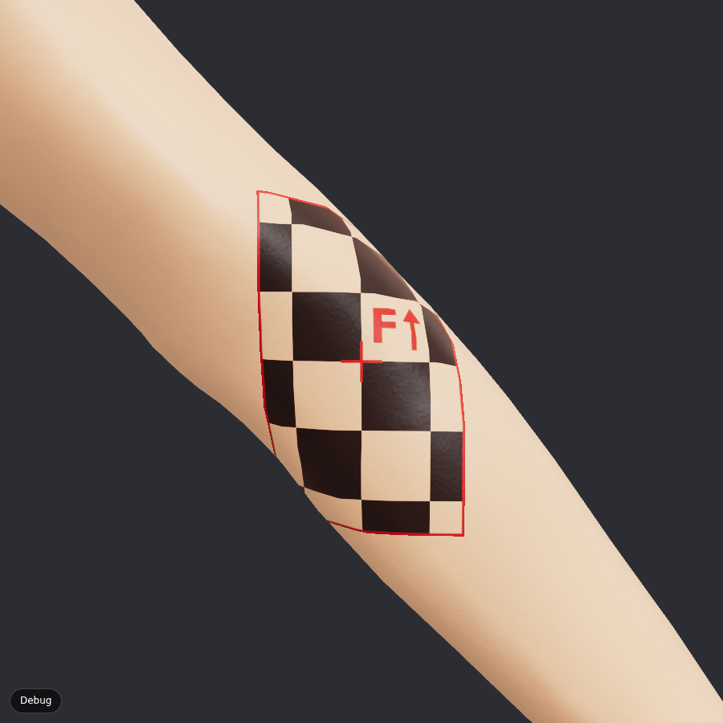
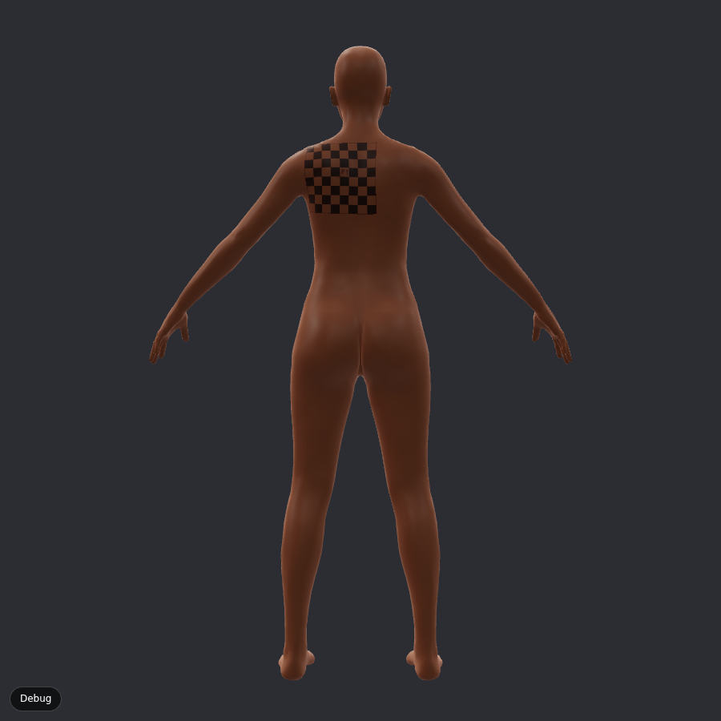
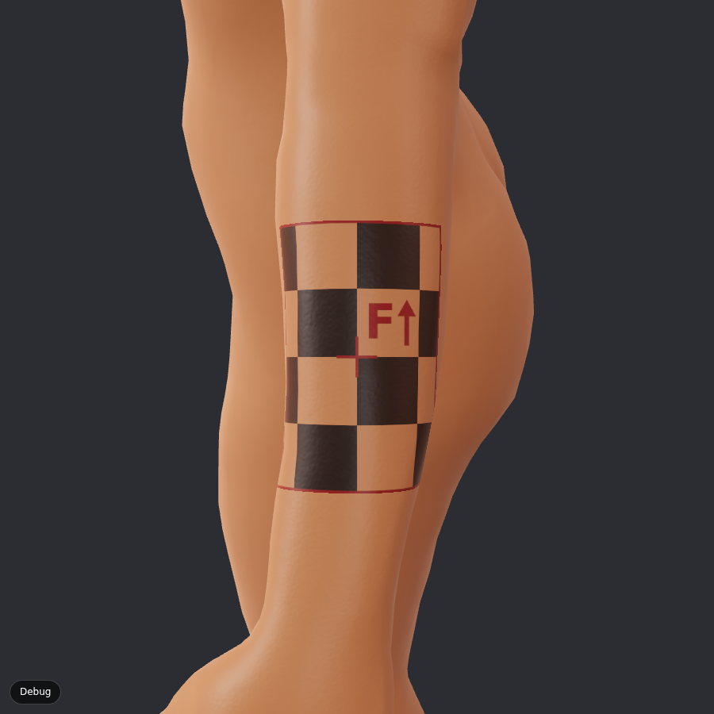
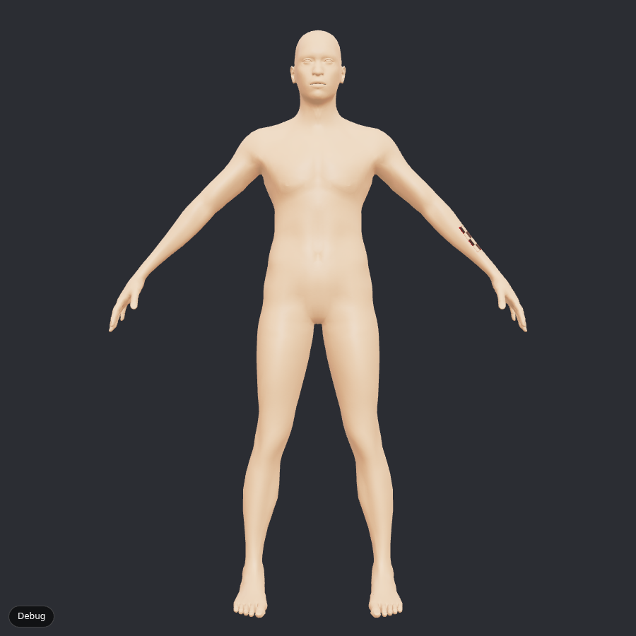
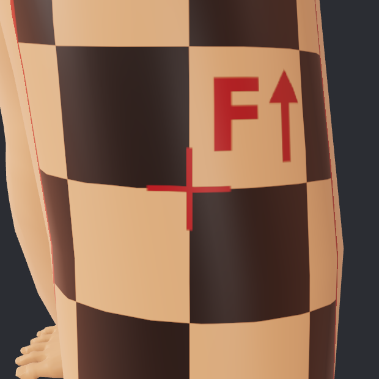

# Phase 1 report: the MVP

Phase 1 turns the Phase 0 test page into a working consult tool: a reshapeable body, real design
import with background removal, automatic wrapping that you can drag around, more realistic skin,
and high-resolution image export. Everything still runs in the browser; designs never leave the
device.

## What's new

| Area | What it does | Where |
|---|---|---|
| Body shape | Height (from the client's height), build and muscle, exact Anny shapes, not uniform scaling. Elbows straightened for consults. | `tools/export_bodies.py`, `src/body/shape.ts` |
| Import | PNG, JPG, WEBP, SVG, PDF, Illustrator `.ai`. Detects type from the file's bytes, page/artboard picker, friendly errors. | `src/import/` |
| Background removal | Line art, outer background, colour key, keep. Tolerance, despeckle, halo removal, edge feather, crop, PNG download. Runs in a Web Worker. | `src/bgremove/`, `src/ui/ImportDialog.tsx` |
| Placement | **Auto** picks the method per spot and size. Tap to place, drag to move (mouse and touch). Exponential map runs in a Web Worker. Placements stay on the same skin when the body is reshaped. | `src/placement/`, `src/ui/Scene.tsx` |
| Skin | Procedural pores and fine bumps, tone and oiliness variation, subsurface glow (per-channel wrap lighting). "Skin detail" toggle for slow devices. | `src/ink/skinMaterial.ts` |
| Export | 3000 px PNG of this view, front, back or close-up. Share sheet on iPad and phones. | `src/ui/Exporter.tsx` |

## Body shape: exact, not approximate

Adding Anny's height, weight and muscle changes together as separate morphs was off by up to
10 cm (weight and muscle interact). But Anny's mesh is exactly trilinear over its anchor grid
(height 0/1 × weight 0/0.5/1 × muscle 0/0.5/1), so the GLB now carries those **18 corner shapes**
as standard glTF morph targets and the app blends them. Checked against Anny itself:
**< 10⁻⁹ mm** error for vertices and joints.

The client's height is matched by solving for Anny's height parameter (bisection), not by scaling,
so a short client doesn't get proportionally thin arms. Range: 1.36–2.45 m (male) and
1.22–2.31 m (female); outside that the app scales. Tests check 1.55–2.00 m to within 0.1 mm.

GLB size: 3.8 MB per body (was 0.84 MB), under the 10 MB budget.

### Straight elbows

Anny's rest pose bends the elbows **44.5°**. The inner-elbow skin folds into a crease, and a design
across it was only 15–31% true to size with up to 38% mirrored. The exporter now straightens the
elbows to 5° (linear blend skinning with Anny's own weights, applied so the 18 shapes stay exactly
blendable). Result across the inner elbow, 3×5 in, surface wrap:

| | Before (bent) | After (straight) |
|---|---|---|
| Male, within 5% | 30.7% | **97.3%** |
| Female, within 5% | 14.7% | **69.9%** |
| Female, mirrored | 37.5% | **0%** |

The female inner elbow is still the hardest spot measured (p95 size error 14%): her arm has a
stronger carrying angle, so the skin still bends there. Designs that cross a joint will always
deform somewhat when the client bends the arm; Phase 2's placement tips will say so.

## Auto placement: when to wrap with a cylinder

Phase 0 recommended the exponential map ("surface wrap") for patches and the cylinder only for bands.
Phase 1 measured where the surface wrap stops working, widening a 3 in tall design on the outer
forearm (base bodies, `npm run measure`):

| Width (share of forearm circumference) | Surface wrap, within 5% | Cylinder, within 5% |
|---|---|---|
| Male 3 in (33%) | 100% | 58% |
| Male 5 in (55%) | 100% | 34% |
| Male 6 in (66%) | 100% | 27% |
| Male 7 in (77%) | 98.7%, **1.3% mirrored** | 24% |
| Female 5 in (65%) | 100% | 29% |
| Female 6 in (78%) | 77.8%, **14.5% mirrored** | 24% |

The surface wrap is better at every width until it starts folding over itself at around 70–78% of
the circumference (on the 5'10" male, a 6 in design is 70% of the forearm and 1.4% of it folds at
the far edges). **Auto** therefore uses the surface wrap everywhere and switches to the cylinder
when:

- the artist ticks **Full band**, or
- the design covers more than **72%** of the limb's circumference, or
- the surface wrap comes out folded (more than 0.5% of the design mirrored). This check runs on
  every placement, so Auto never shows a folded design.

Bands still close exactly (0.00 mm seam).

## Background removal

Pipeline from the spec, tuned for tattoo art (`src/bgremove/pipeline.ts`):

1. Keep existing transparency. 2. Background = median of the outer ring. 3. Auto mode:
   light neutral background + grey artwork → **line art**; light background + colour →
   **outer background**; coloured background → **colour key** (eyedropper to pick another colour).
4. Clean-up: tolerance, despeckle, halo removal, feather. 5. Crop to the design.

Choices that matter for tattoo art:

- **Line art works in linear light and white-balances to the paper first.** A scan tints the ink
  with the paper colour too, so this keeps grey wash grey on cream paper. Near-neutral marks
  become **black ink at reduced strength**, which is what grey wash is, so it renders correctly
  when multiplied into skin.
- **Outer background** flood-fills from the edges only, so intentional white highlights inside a
  colour design stay. Edge pixels within 2 px of the background are un-mixed from it, so there is
  no white halo.
- **Feathering only softens inwards**, so cleared background never comes back as a fringe.
- The default despeckle (islands under 1/100,000 of the image) removes scan dust but keeps
  dotwork dots.

Tests on the spec's six fixture types all pass (`src/bgremove/pipeline.test.ts`): black line art on
white, scanned sketch on off-white paper with noise, JPEG blocks and dust, colour flash with white
highlights, design on a teal background, already transparent PNG. Plus grey wash on warm paper.
**Speed: a 4000 × 3000 px image takes 0.9 s** (target 2 s), in a worker so the 3D view keeps running.

## Import

- Type comes from the file's bytes, so a PNG named `.jpg` or a PDF from the iPad Files app with no
  extension still works.
- PDF and PDF-compatible `.ai` use pdf.js (Apache 2.0), loaded only when needed. Multi-page PDFs
  and multi-artboard `.ai` files show thumbnails to pick from. Vectors (SVG, PDF, `.ai`) are
  rasterised at 4096 px on the long side, transparent background.
- `.ai` saved without PDF compatibility (or Illustrator 8 and older) shows: "Re-save it from
  Illustrator with 'Create PDF Compatible File' checked, or export it as PNG or SVG."
- **Compatibility fix found by testing:** pdf.js 6 uses a brand-new JavaScript feature
  (`Map.getOrInsertComputed`) that current Chrome and iPad Safari don't have. We load pdf.js's
  "legacy" build, which works on both.

## Checks

| Check | Result |
|---|---|
| Unit tests (`npm test`) | 32 pass: wrap math, exponential map, distortion metric, body shape (exact heights, girth grows with build), import detection, PDF fixtures, background removal fixtures and speed |
| End-to-end in a real browser (`node scripts/e2e.mjs`) | 16 checks pass: auto method on forearm/back, full band and wide design switch to cylinder, drag moves the design, client height 1.60 m gives a 1.600 m body, PNG import auto-picks line art and places the design, 3-page PDF page picker, PDF-compatible `.ai` opens, old `.ai` shows the re-save message, 2250 × 3000 px export, no errors |
| Dependency licenses | 22 production packages: 20 MIT, 1 Apache 2.0 (pdf.js), 1 BSD-3-Clause |
| Distortion study (`npm run measure`) | [metrics.md](metrics.md) |

### Spec acceptance checks

| Check | Status |
|---|---|
| 1-inch grid on a forearm within 5% per cell, square | **Met** by Auto (surface wrap): 92–96% of the design area within 5%, mean size error 1.2–1.5% |
| Full 360° band closes with no gap or overlap | **Met**: 0.00 mm seam, measured on every ring |
| Back piece across a UV seam shows no seam line | Met by construction (placement is computed in 3D). Formal check comes with the Phase 2 ink-map bake |
| Black line drawing on white: clean, halo-free lines, clear gaps | **Met** (fixture tests, including a halo check on every visible pixel) |
| PDF-compatible `.ai` imports; non-compatible `.ai` shows the re-save message | **Met** (unit and end-to-end tests) |
| Works with touch on iPad Safari | **Not verified on a device.** Touch drag, the share sheet and the pdf.js legacy build were built for it; please try it on the studio iPad |

## Screenshots

| | |
|---|---|
|  Opens on the design, Auto on the outer forearm |  Import: background removal before/after |
|  6 in wide on a 5'10" forearm: the surface wrap would fold, so Auto uses the cylinder |  7 in wide: cylinder |
|  Full band, seen from behind: seamless |  Across the straightened inner elbow |
|  Same spot with a flat decal, for comparison |  8×8 in back piece, darker skin |
|  Female, 5'3", heavy build |  Male, 6'2", lean and muscular |
|  Skin detail on, 12 cm away |  Skin detail off |

Full-body export: [e2e-export-front.png](e2e-export-front.png) (2250 × 3000 px).

## Known limitations

- One design at a time. Layers, mirror-to-other-side and the ink-map bake are Phase 2.
- Skin is still a stylised shader (no photographed skin texture); healed/fresh/aged ink looks are
  Phase 2.
- Rotation and size are sliders; there are no on-body handles yet.
- Placement across a strongly bent joint (female inner elbow) is the weakest case measured.
- On the hosted artifact preview, downloads (PNG export, transparent PNG) are blocked by the
  preview's sandbox. They work when the app is hosted normally (GitHub Pages or any web host).
